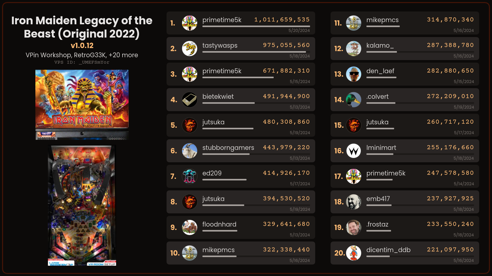
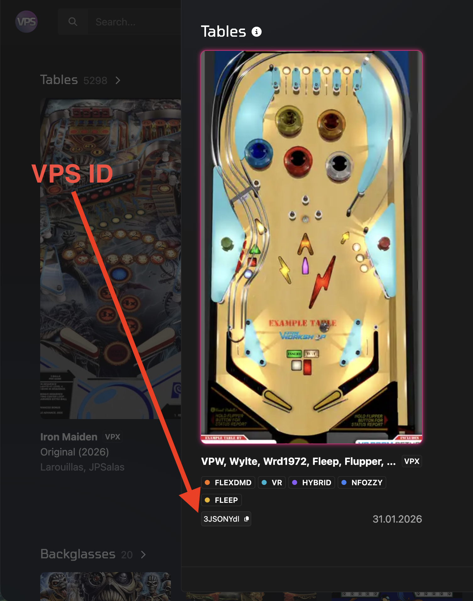
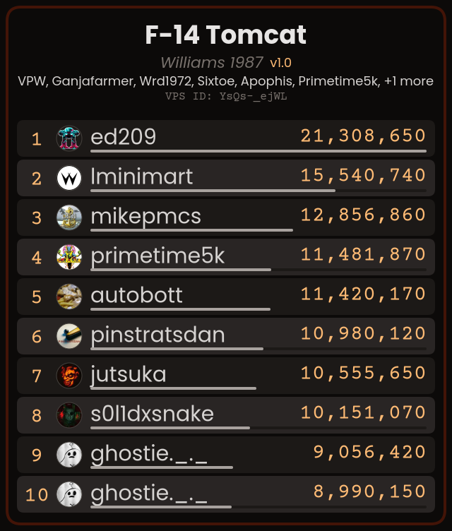

# vpc-get-high-scores-image

This tool pulls data from the VPC API and creates leaderboard images for PinUP Popper to display when a mapped button is pressed. It supports two modes:

- **High Scores**: All-time high scores for any table tracked on VPC, saved per-table by game name
- **Weekly Leaderboard**: The current VPC Competition Corner weekly leaderboard, saved as a single image

Images can be updated on startup, when entering a table, or when exiting a table.



**CAUTION: Please make sure you backup your PinUP Popper DB before making these changes!!!**

---

## Adding VPS ID to table(s) in PinUP Popper

This tool requires a VPS ID from <https://virtualpinballspreadsheet.github.io/> (hereby known as VPS) to be stored in a custom field in your PinUP Popper database.

1. Download an updated `puplookup.csv` from VPS to your PinUPSystem folder:
   <https://virtualpinballspreadsheet.github.io/export>

2. Import data for each table via PinUP Popper's Game Manager so the VPS ID is written into the custom field you configured in the Popper Setup Lookup settings tab.

You can find the VPS ID for any table here:


---

## Setup: Batch File on Windows Startup

1. Download the latest release from <https://github.com/emb417/vpc-get-high-scores-image/releases> and copy all files to your `LAUNCH` folder (typically `C:\Pinball\PinUPSystem\LAUNCH`).

   > **Note:** If you used Baller Installer, your LAUNCH folder may be in a different location.

2. Open `POPMENU_GetHighScoresForAllTables.bat` and edit the invocations to match your setup. The bat file runs the exe twice — once for high scores, once for the weekly leaderboard:

```bat
REM High scores leaderboard — one image per table saved to Other2
"%_curloc%vpc-get-high-scores-image.exe" "True" "" "CUSTOM3" "%_ParentFolderName%" "%_ParentFolderName%\POPmedia\Visual Pinball X\Other2" "20" "" "landscape"

REM Weekly leaderboard — single image saved to BackGlass
"%_curloc%vpc-get-high-scores-image.exe" "weekly" "%_ParentFolderName%\POPMedia\Default\BackGlass" "pl_TOTW" "" "landscape"
```

### High Scores Parameters

| #   | Parameter        | Example                                | Description                                                                                                          |
| --- | ---------------- | -------------------------------------- | -------------------------------------------------------------------------------------------------------------------- |
| 1   | `updateAll`      | `True`                                 | If `True`, updates all tables in PinUP Popper (EMUID=1). If `False`, updates only the table matching `vpsId`.        |
| 2   | `vpsId`          | _(empty)_                              | VPS ID of a specific table. Ignored when `updateAll` is `True`.                                                      |
| 3   | `vpsIdField`     | `CUSTOM3`                              | The PinUP Popper custom field that stores the VPS ID. Must match what you configured in Step 1.                      |
| 4   | `dbPath`         | `C:\Pinball\PinUPSystem`               | Path to your PinUP Popper database directory.                                                                        |
| 5   | `mediaPath`      | `...\POPMedia\Visual Pinball X\Other2` | Directory where high score images will be saved.                                                                     |
| 6   | `numRows`        | `20`                                   | Number of score rows to display (max 20).                                                                            |
| 7   | `fileNameSuffix` | _(empty)_                              | Optional suffix appended to the image filename (e.g. `_HS` produces `GameName_HS.png`).                              |
| 8   | `layout`         | `landscape`                            | `landscape` (1920×1080, 3-column with table art) or `portrait` (640px wide, single column). Defaults to `landscape`. |

### Weekly Leaderboard Parameters

| #   | Parameter        | Example                          | Description                                                            |
| --- | ---------------- | -------------------------------- | ---------------------------------------------------------------------- |
| 1   | `weekly`         | `weekly`                         | Triggers weekly leaderboard mode. Must be the literal string `weekly`. |
| 2   | `mediaPath`      | `...\POPMedia\Default\BackGlass` | Directory where the weekly leaderboard image will be saved.            |
| 3   | `fileName`       | `pl_TOTW`                        | Output filename (without extension). Defaults to `pl_TOTW`.            |
| 4   | `fileNameSuffix` | _(empty)_                        | Optional suffix appended to the filename.                              |
| 5   | `layout`         | `landscape`                      | `landscape` or `portrait`. Defaults to `landscape`.                    |

---

## Setup: Run on Table Launch and Close

1. Open PinUP Popper Setup > Popper Setup Tab > Emulators > Visual Pinball X > Launch Setup Tab

2. Paste the following at the end of the **Launch Script**:

```
START /min "" "[STARTDIR]LAUNCH\vpc-get-high-scores-image.exe" "False" "[CUSTOM3]" "CUSTOM3" "C:\Pinball\PinUPSystem" "C:\Pinball\PinUPSystem\POPMedia\Visual Pinball X\Other2" "20" "" "landscape"
```

> Change `CUSTOM3` to match the field you configured in the setup step above.

3. Save and Close.

---

## Enable the Other2 Display in PinUP Popper

1. PinUP Popper Setup > Popper Setup Tab > GlobalConfig > Displays tab
   - Set `Other 2` = `Active Hidden`
2. Save.

3. PinUP Popper Setup > Popper Setup Tab > Screens / Themes button

4. In Pup Pack Editor, set the `Mode` field of `Other` to `ForcePop`

5. Click **Save PuP-Pack**.

---

## Configure and Place the Other2 Display

1. In the Pup Pack Editor, click **Configure Display/Locations**

2. On the PinUP Player Displays window, select `Other2` from the screen list

3. Adjust the display to your liking. High score images are 1920×1080 (landscape) or 640px wide (portrait).
   - Suggested settings for a backglass screen:
     - Rotation: `none`
     - Width: `1920`
     - Height: `1080`
     - Default State: `off`

   - Suggestions for a portrait layout (10 rows):
     - Rotation: `none`
     - Width: `640`
     - Height: `752`
     - Default State: `off`

     > **Note:** Portrait images are 640px wide and scale in height based on the number of rows. 10 rows produces a 640×752 image. Use `"portrait"` as the `layout` parameter and set `numRows` to `10` when generating the image.

     

4. Click **Save Settings** and close the Pup Pack Editor.

---

## Configure a Button to Show the High Score Display

1. PinUP Popper Setup > Controller Setup

2. Assign a key press to the `Show Other` entry

3. Click **Close**, then **Exit Setup**.

---

## Testing

1. Navigate to `C:\Pinball\PinUPSystem\LAUNCH`

2. Run `POPMENU_GetHighScoresForAllTables.bat`

   You should see a command window executing and pulling down images. Check your `Other2` and `BackGlass` media folders to confirm images are being created.

3. Launch PinUP Popper, navigate to a table, and press the button you configured to display `Other2`.
